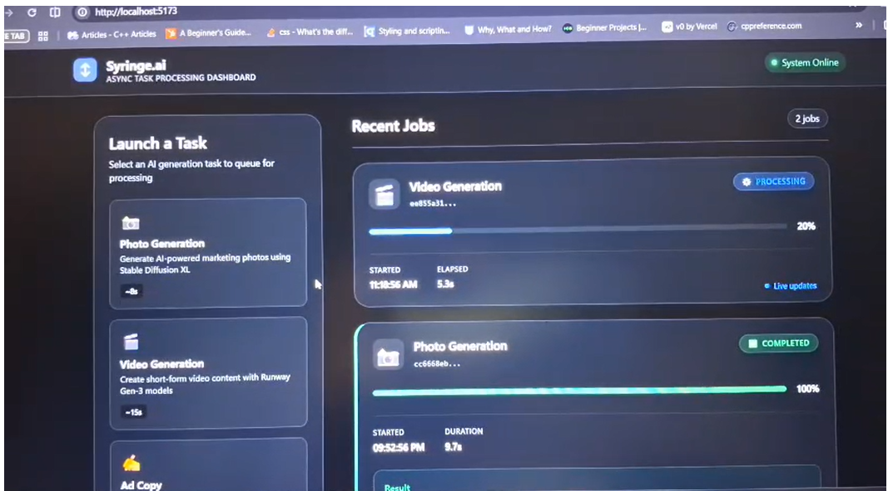
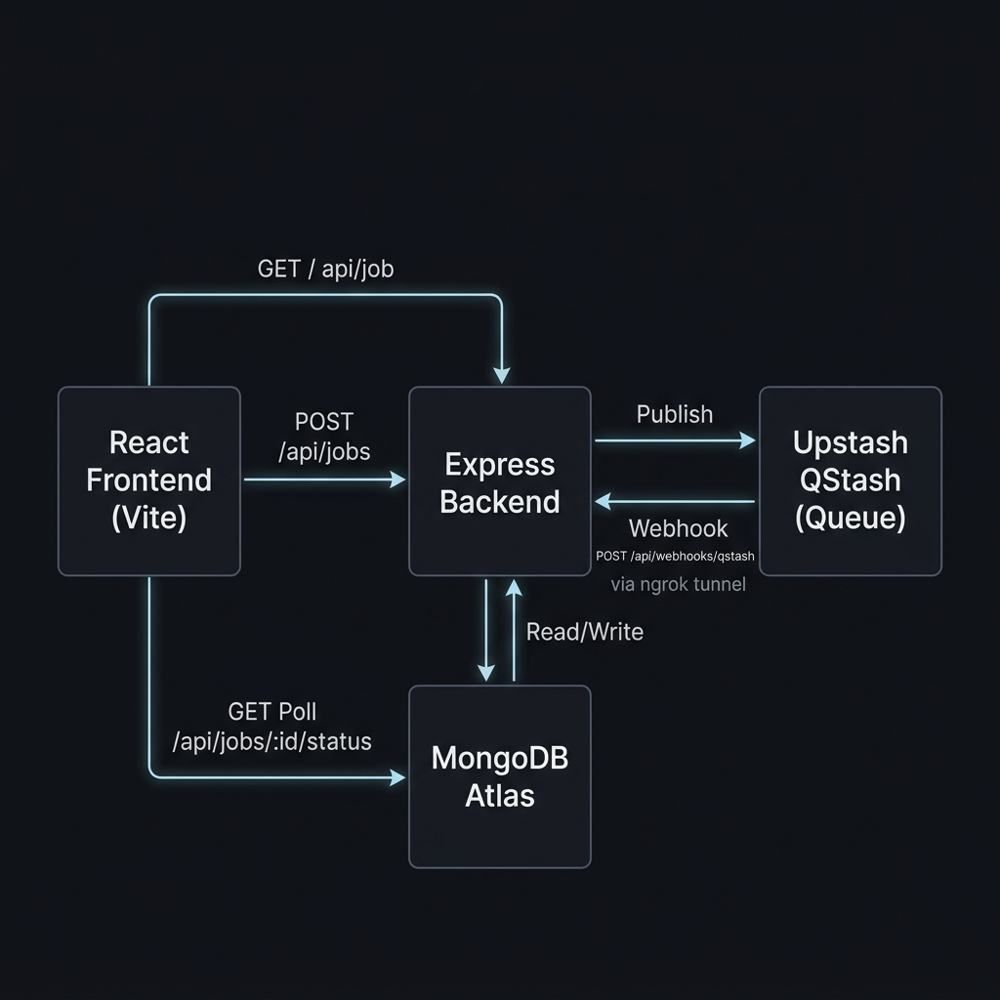

# syringe-intern-frontend

> **Frontend Dashboard** for the Syringe.ai Intern Assignment — a responsive, high-performance React + Vite dashboard designed to interact with the asynchronous task processing backend.



---

## 🎨 Design & Aesthetics

This frontend features a **premium dark-theme user interface** with standard modern design patterns:
*   **Color Palette:** Deep navy/charcoal backgrounds (`#0B0E14`, `#151A23`) paired with vivid neon accents (Indigo `#6C63FF`, Emerald `#10B981` for success, Amber `#EAB308` for pending, and Rose `#EF4444` for failures).
*   **Glassmorphism:** Components leverage semi-transparent background backdrops with subtle border glow highlights.
*   **Micro-animations:** Active jobs display pulsating status lights, smooth progress transitions, and spinning icons.
*   **Optimistic UI:** When a job is initiated, a placeholder "Pending" card is immediately rendered to provide immediate user feedback.

---

## 🚀 Key Features

*   **Real-time Independent Polling:** Employs a custom polling hook that polls individual task states every 2 seconds without triggering global page re-renders.
*   **Smart Resource Optimization:** Polling automatically terminates as soon as a job reaches a terminal state (`COMPLETED` or `FAILED`), minimizing network overhead.
*   **Granular Progress Visualization:** Dynamically displays processing status with accurate percentages and custom progress indicators based on actual backend updates.
*   **Responsive Flexbox & Grid Layout:** Fully optimized to scale beautifully from mobile screens to high-resolution desktop monitors.
*   **Robust Configuration Defenses:** Includes a local `postcss.config.js` configuration to prevent parent-directory dependency lookup conflicts in Vite.

---

## 🛠️ Project Structure

The project code is organized cleanly as follows:

```
syringe-intern-frontend/
├── public/                  # Static assets
├── src/
│   ├── api/
│   │   └── jobApi.js        # Axios/Fetch client wrapper for Backend API calls
│   ├── components/
│   │   ├── Header.jsx       # Application header bar with brand logo & status
│   │   ├── JobCard.jsx      # Individual job display, orchestrates its own polling
│   │   ├── JobList.jsx      # Grid layout holding all active/inactive job cards
│   │   ├── StatusBadge.jsx  # Styled status indicators (Pending, Processing, etc.)
│   │   └── TaskSelector.jsx # UI panel to select and trigger a new async task
│   ├── hooks/
│   │   └── useJobPolling.js # Custom polling hook managing task-specific fetch loops
│   ├── assets/              # App images and svg icons
│   ├── App.css              # Main application Layout CSS
│   ├── App.jsx              # App root component (orchestrator for task lists & state)
│   ├── index.css            # Global CSS variables, reset styles, and animations
│   └── main.jsx             # React DOM bootstrapping entrypoint
├── .env.example             # Template file for configuring local environment variables
├── .gitignore               # Multi-layer git ignore patterns
├── package.json             # NPM project scripts and dependencies
├── postcss.config.js        # PostCSS configuration file (prevents parent-directory lookup)
└── vite.config.js           # Vite development server configuration
```

---

## ⚙️ Prerequisites

*   **Node.js** v18.0.0 or higher
*   **npm** v9.0.0 or higher
*   A running instance of the **syringe-intern-backend** (running locally or exposed via a public URL)

---

## 🏁 Step-by-Step Setup

### 1. Installation

First, clone this repository (or copy it to your local environment) and install all node packages:

```bash
# Clone the repository
git clone https://github.com/<your-username>/syringe-intern-frontend.git

# Navigate to the frontend directory
cd syringe-intern-frontend

# Install dependencies
npm install
```

### 2. Configure Environment Variables

Create your local `.env` configuration file. By default, the application looks for a local backend at `http://localhost:4000/api`.

```bash
# Copy template env
cp .env.example .env
```

Open `.env` and configure the backend URL:

```env
VITE_API_BASE_URL=http://localhost:4000/api
```

*(Note: If you are running the backend via ngrok or deploying to a cloud hosting environment, update `VITE_API_BASE_URL` to match the public URL).*

### 3. Run Development Server

Launch the Vite hot-reloading development server:

```bash
npm run dev
```

*   The local dashboard will be accessible at: **[http://localhost:5173](http://localhost:5173)**

---

## 🔬 Deep Dive: State & Logic

### Custom Polling Hook (`useJobPolling`)

Rather than re-rendering the entire dashboard list, polling is offloaded to a card-level React hook [useJobPolling.js](file:///d:/Downloads/cyringe/syringe-intern-frontend/src/hooks/useJobPolling.js).

Key design features of this hook:
1.  **Stale Closure Prevention:** Uses React `useRef` to store the callback handlers so that the interval loop always triggers with the most up-to-date states.
2.  **Self-Termination:** If a job responds with `COMPLETED` or `FAILED`, the internal `setInterval` clears itself automatically.
3.  **Automatic Memory Cleanup:** If the user leaves the page or a card gets unmounted, the cleanup handler clears the interval immediately to prevent memory leaks.

### API Integration (`jobApi.js`)

All API interactions are abstracted inside [jobApi.js](file:///d:/Downloads/cyringe/syringe-intern-frontend/src/api/jobApi.js):
*   `fetchJobs()`: Retrieves the history of all existing jobs.
*   `createJob(taskType)`: Sends a `POST` request to spawn a background job.
*   `fetchJobStatus(jobId)`: Retrieves current progress (`0-100%`) and status of an individual job.

---

## 📦 Production Deployment

To generate a minified, production-ready static bundle:

```bash
npm run build
```

This compiles your assets into the `dist/` folder. You can preview the production bundle locally using:

```bash
npm run preview
```

The output folder (`dist`) can be hosted directly on static providers like Vercel, Netlify, Cloudflare Pages, or AWS S3.

---

## 📄 License

Distributed under the ISC License. See `package.json` for details.
